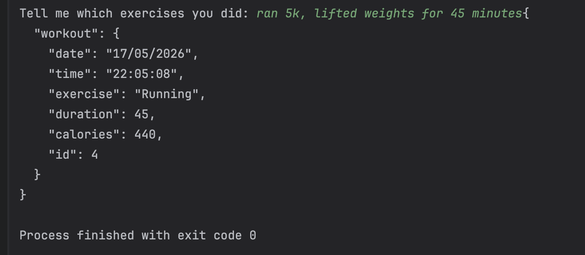
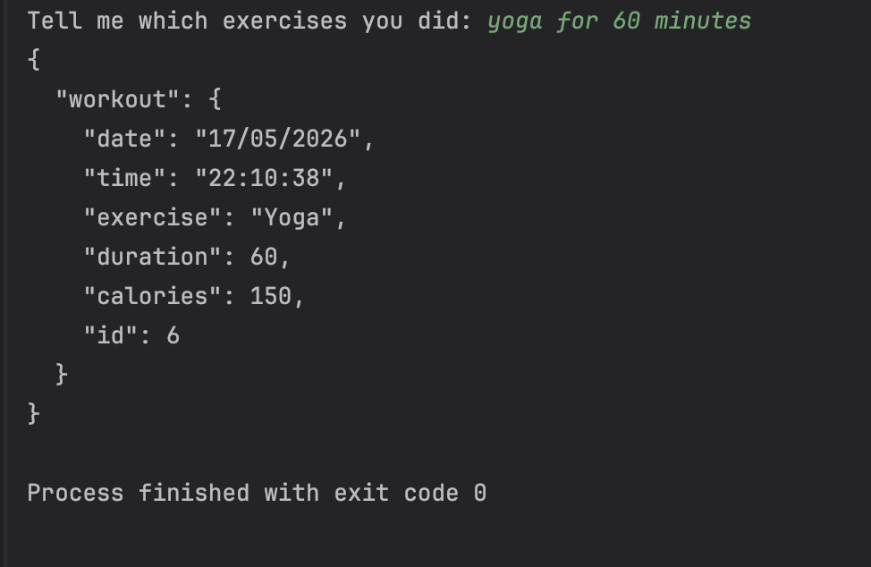
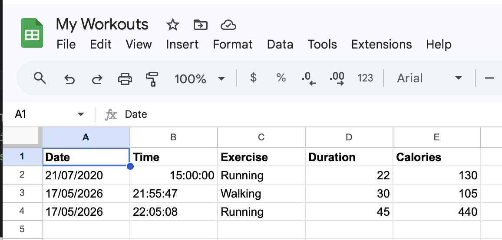
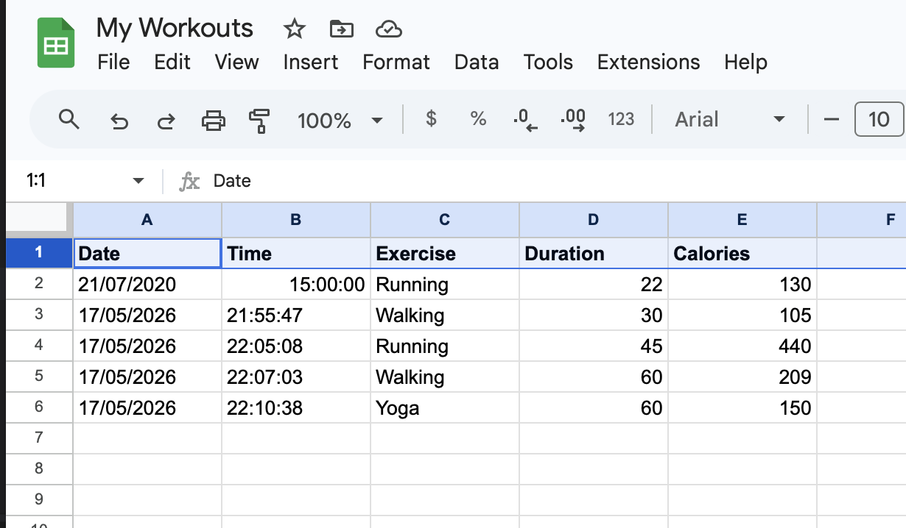

# Workout Tracker API

A Python workout tracker that uses the Nutritionix API to process natural language exercise input and automatically logs workout data into Google Sheets using the Sheety API.

## Features

* Natural language exercise tracking
* Automatic calorie estimation
* Google Sheets workout logging
* API integration with Nutritionix and Sheety

## Technologies Used

* Python
* Requests
* Nutritionix API
* Sheety API
* Google Sheets

## Example Input

walked 3 miles

## Example Output

* Exercise: Walking
* Duration: 30 minutes
* Calories: 105

## Screenshots

### Terminal Output

### Google Sheets Integration

## Future Improvements

* Environment variables for API keys
* Better natural language parsing
* Web interface
* Workout analytics dashboard
